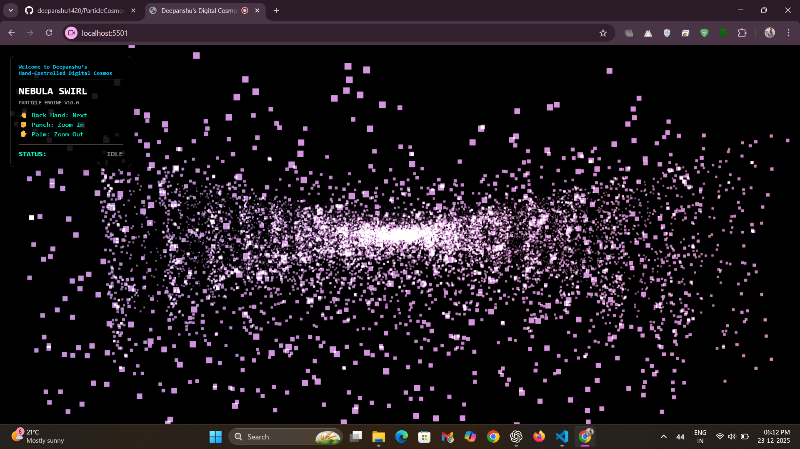
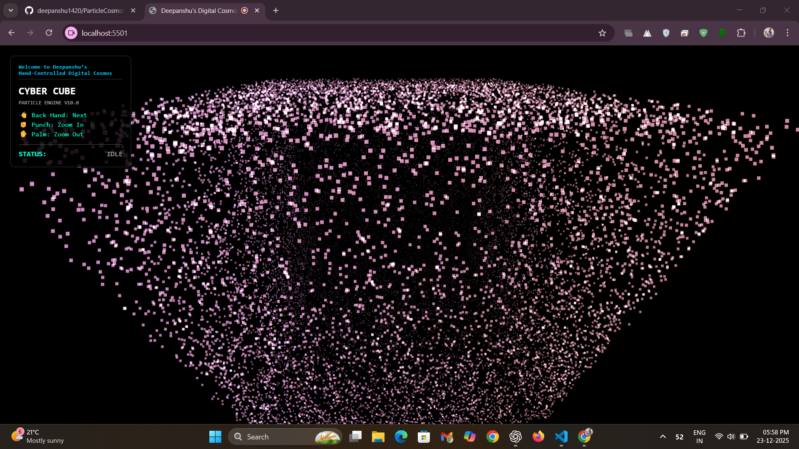
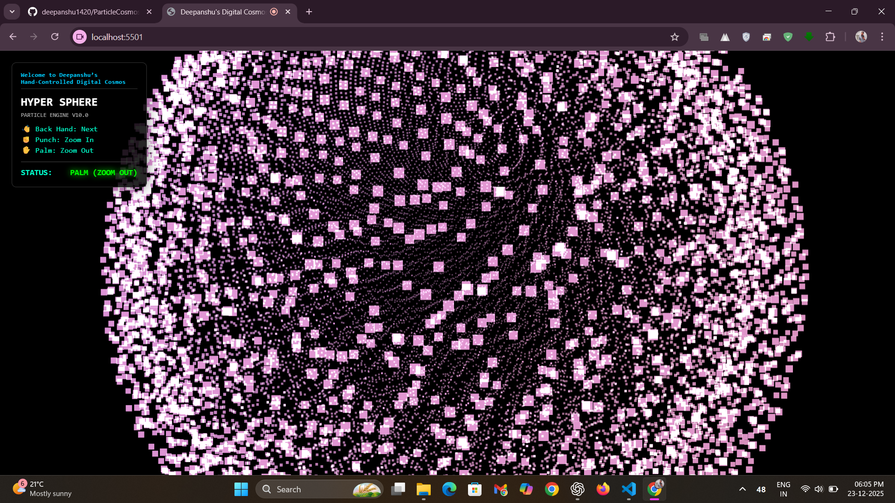
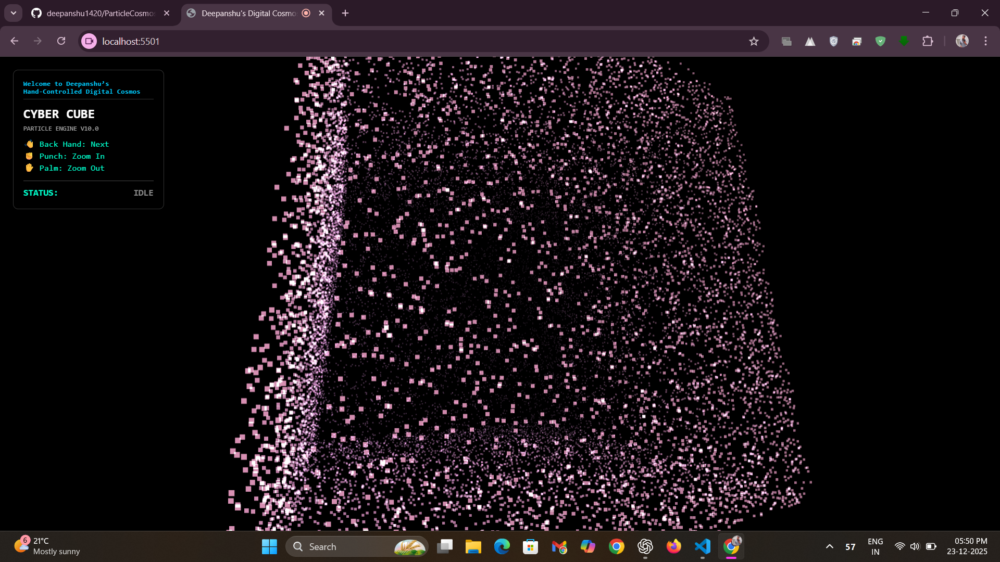
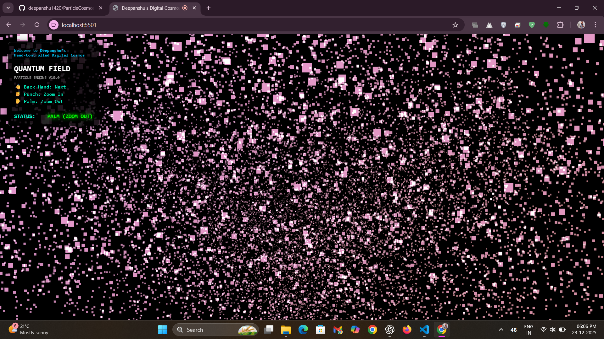

# ✨ ParticleCosmos

[](https://threejs.org/)
[](https://google.github.io/mediapipe/)
[](https://developer.mozilla.org/en-US/docs/Web/JavaScript)
[](https://developer.mozilla.org/en-US/docs/Web/HTML)
[](https://developer.mozilla.org/en-US/docs/Web/CSS)

**A fun, interactive web app where you control a universe of 3D particles using just your hand movements.**

---

🌐 **Try the Particle Cosmos in your browser :** [Live Demo](https://particlecosmos.netlify.app/)

---

## 🌟 Overview
**ParticleCosmos** turns your webcam into a controller. By simply moving your hand, you can interact with thousands of floating particles that form beautiful 3D shapes.

It uses **MediaPipe** to track your hand and **Three.js** to create the visuals, allowing you to fly through different "digital universes" like a Nebula or a Cyber Cube without touching your keyboard or mouse.

---

## ⚡ Features
- **Control particles motion through hand gestures:**
  - 👋 **Showing Back of your Hand:** Switches to the next shape.
  - ✊ **Showing Fist (punch):** Zooms into the particles.
  - ✋ **Showing Open Palm:** Zooms out the particles.
- **Cool 3D Shapes:** Watch particles instantly form into shapes like a *Nebula Swirl*, *Cyber Cube*, *Hyper Sphere*, and more.
- **Smooth Animation:** The particles flow and rotate automatically, reacting smoothly to your movements.
- **Modern Design:** Features a clean, glass-like interface that overlays the action.

---

## 🛠 Tech Stack
- **Three.js:** The tool used to draw the 3D particles and handle the graphics.
- **MediaPipe Hands:** The technology that lets the computer "see" and track your hand through the webcam.
- **JavaScript:** The logic that connects your hand movements to the visuals.
- **HTML & CSS:** Builds the website structure and makes it look good.

---

## 📌 Important Notes (Before Running this project):
- This project requires webcam access to track hand gestures for particle interaction such as zooming and movement. Please allow camera permission when prompted.
- If you open the .html file directly in your browser, modern browsers like Chrome, Edge, and Firefox may block webcam access for security reasons.
- I’ve implemented logic in the code to redirect the site to a localhost URL. If you see a warning, simply click “Fix URL Automatically” on the webpage to continue safely.

---

## 🖼 Screenshots

### Nebula Swirl

*A spiral galaxy shape made of particles.*

### Cyber Cube

*A large 3D box filled with glowing dots.*

### Hyper Sphere

*A round, planet-like ball of particles.*

### Cyber Cube (Side View)

*The cube viewed from a different angle.*

### Quantum Field

*A scattered field of particles floating freely.*

---

## 🛠 Installation/Usage

If you want to run this project on your own computer:

```bash
# Clone the repository
git clone <your-repo-link>

# Navigate to the project folder
cd particlecosmos

# Open index.html in your browser or click on Go Live (Server Extension in Vs Code)

